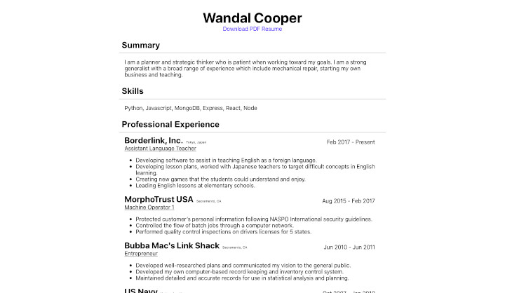

# [Web Resume](https://wmcooper2/web-resume)
My resume made for the web in English and Japanese.



## Purpose/Goal
To have an electronic version of my resume easily accessible that has a similar format to my paper version but with working links.

## Operation
Click on the links in the document.

## Tech/Libraries Used
* HTML
* CSS
* JavaScript
* React

## Problems/Solutions
* The hardest part is getting the proper Japanese translated right. Fortunately, I can try it myself, then ask for help from my Japanese friends.
* Google translate makes the translations weird and it isn't a good thing to use it as a crutch, so I just have to keep studying and improve my Japanese the right way.
* Getting the PDF, Word document and the web version to work together was a small hassle because everything had to be done manually between 3 different ways of doing things (PDF, Microsoft, and the browser).

## More Information
Updating after a long break;  
```bash
pip3 install nodeenv
nodeenv env
. env/bin/activate
npm update
```

Then the React dependencies were causing a problem, so;  
1. Delete react, react-dom and react-scripts from `package.json`.  
2. Reinstall them.  
3. Run `npm start`.  
...Works.

